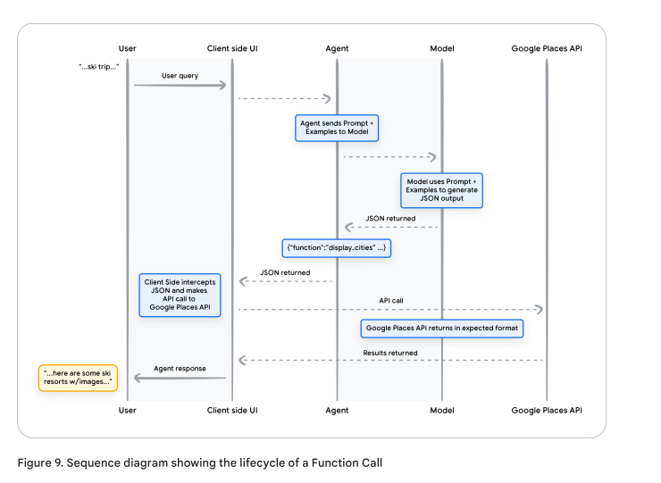

<div style="page-break-before: always;"></div>

# エージェント

著者: Julia Wiesinger, Patrick Marlow, Vladimir Vuskovic

## 謝辞

レビュアーおよび貢献者:
- Evan Huang
- Emily Xue 
- Olcan Sercinoglu
- Sebastian Riedel
- Satinder Baveja
- Antonio Gulli
- Anant Nawalgaria

キュレーターおよび編集者:
- Antonio Gulli
- Anant Nawalgaria 
- Grace Mollison

テクニカルライター:
- Joey Haymaker

デザイナー:
- Michael Lanning

## 目次

1. はじめに

2. エージェントの基礎
   - エージェントとは何か？
   - エージェントとモデルの比較
   - 認知アーキテクチャ：エージェントの動作方法
3. エージェントの主要コンポーネント
   - モデル
   - ツール
   - オーケストレーションレイヤー
4. ツール：外部世界へのカギ
   - 拡張機能
     - サンプル拡張機能
   - 関数
     - ユースケース
     - 関数のサンプルコード
   - データストア
   - ツールのまとめ
5. 対象学習によるモデルパフォーマンスの向上
6. LangChainによるエージェントのクイックスタート
7. Vertex AIエージェントによる本番アプリケーション
8. まとめ
9. 注釈

<div style="page-break-before: always;"></div>


**この推論、論理、外部情報へのアクセスを組み合わせた機能は、生成AIモデルの単独の機能を超えて拡張するプログラムである「エージェント」という概念を呼び起こします。**

## はじめに

人間はパターン認識タスクに優れていますが、結論に至る前に本やGoogle検索、電卓などのツールを使って既存の知識を補完することがよくあります。人間と同様に、生成AIモデルもツールを使用して、リアルタイムの情報にアクセスしたり、実世界のアクションを提案したりするように訓練することができます。

例えば、モデルはデータベース検索ツールを活用して、顧客の購入履歴などの特定の情報にアクセスし、パーソナライズされたショッピング推奨を生成することができます。あるいは、ユーザーのクエリに基づいて、同僚にメール返信を送信したり、金融取引を完了したりするために、様々なAPIコールを行うこともできます。

これを実現するには、モデルが外部ツールへのアクセスを持つだけでなく、自己主導的な方法でタスクを計画し実行する能力が必要です。この推論、論理、外部情報へのアクセスを組み合わせた機能は、生成AIモデルの単独の機能を超えて拡張するプログラムである「エージェント」という概念を呼び起こします。

このホワイトペーパーでは、これらの側面とそれに関連する側面について詳しく説明します。

<div style="page-break-before: always;"></div>

## エージェントとは何か？

最も基本的な形式では、生成AIエージェントは、世界を観察し、利用可能なツールを使用して行動することにより、目標の達成を試みるアプリケーションとして定義できます。エージェントは自律的で、人間の介入なしに独立して行動することができます。特に、達成すべき適切な目標や目的が与えられている場合はそうです。

エージェントはまた、目標達成へのアプローチにおいて積極的になることができます。人間からの明示的な指示がない場合でも、エージェントは最終目標を達成するために次に何をすべきかを推論することができます。

エージェントの内部動作を理解するために、まずエージェントの行動、アクション、意思決定を駆動する基本的なコンポーネントを紹介しましょう。これらのコンポーネントの組み合わせは認知アーキテクチャと呼ばれ、これらのコンポーネントを組み合わせることで多くのアーキテクチャを実現することができます。

コア機能に焦点を当てると、エージェントの認知アーキテクチャには3つの重要なコンポーネントがあります：


### モデル

エージェントのスコープにおいて、モデルとはエージェントプロセスの中央決定者として利用される言語モデル(LM)を指します。エージェントによって使用されるモデルは、ReAct、Chain-of-Thought、Tree-of-Thoughtsなどの指示ベースの推論とロジックフレームワークに従うことができる、任意のサイズ(小/大)の1つまたは複数のLMとすることができます。

モデルは、特定のエージェントアーキテクチャのニーズに基づいて、汎用、マルチモーダル、または微調整されたものにすることができます。最良の本番結果を得るためには、目的のエンドアプリケーションに最適なモデルを活用し、理想的には認知アーキテクチャで使用を計画しているツールに関連するデータシグネチャで訓練されたモデルを使用する必要があります。

モデルは通常、エージェントの特定の設定（ツールの選択、オーケストレーション/推論のセットアップなど）で訓練されていないことに注意することが重要です。ただし、エージェントの機能を示す例、特定のツールの使用や様々なコンテキストでの推論ステップのインスタンスを含む例を提供することで、エージェントのタスクに対してモデルをさらに改良することは可能です。

### ツール

基盤モデルは、テキストや画像の生成において印象的な能力を持っていますが、外部世界とのインタラクションができないという制約があります。ツールはこのギャップを埋め、エージェントが外部データやサービスとやり取りすることを可能にし、基盤モデル単独の能力を超えた幅広いアクションを実現します。

ツールは様々な形態を取ることができ、複雑さのレベルも様々ですが、通常はGET、POST、PATCH、DELETEなどの一般的なWeb APIメソッドに準拠しています。例えば、ツールはデータベース内の顧客情報を更新したり、ユーザーに提供する旅行推奨に影響を与える天気データを取得したりすることができます。

ツールを使用することで、エージェントは実世界の情報にアクセスして処理することができます。これにより、検索拡張生成（RAG）のような、より専門的なシステムをサポートすることが可能になり、基盤モデル単独で達成できる以上の能力を大幅に拡張します。ツールについては後で詳しく説明しますが、最も重要なことは、ツールがエージェントの内部機能と外部世界との間のギャップを埋め、より広範な可能性を実現するということです。

### オーケストレーションレイヤー

オーケストレーションレイヤーは、エージェントが情報を取り込み、内部で推論を実行し、その推論を使用して次のアクションや決定を行う循環的なプロセスを表します。一般的に、このループはエージェントが目標に到達するか、停止点に達するまで継続します。

オーケストレーションレイヤーの複雑さは、エージェントと実行しているタスクによって大きく異なる場合があります。一部のループは決定ルールを持つ単純な計算である場合もあれば、連鎖的なロジック、追加の機械学習アルゴリズム、その他の確率的推論技術を実装する場合もあります。エージェントオーケストレーションレイヤーの詳細な実装については、認知アーキテクチャのセクションで説明します。

### エージェントとモデルの比較

エージェントとモデルの違いをより明確に理解するために、以下の比較表を参照してください：

 特徴 | モデル | エージェント |
|------|--------|--------------|
| 知識の範囲 | 訓練データで利用可能な範囲に限定 | ツールを介した外部システムとの接続により拡張可能 |
| 推論/予測能力 | ユーザークエリに基づく単一の推論/予測のみ | オーケストレーションレイヤーでの決定とユーザークエリに基づく複数ターンの推論/予測が可能 |
| セッション管理 | 明示的に実装されていない限り存在しない | セッション履歴を管理して複数ターンの推論/予測が可能 |
| ツール実装 | ネイティブな実装なし | エージェントアーキテクチャにネイティブに実装 |
| ロジックレイヤー | ネイティブな実装なし。単純な質問または推論フレームワーク（CoT、ReActなど）を使用したプロンプト形成のみ | CoT、ReAct、LangChainなどの事前構築されたフレームワークを使用するネイティブな認知アーキテクチャを持つ |


### 認知アーキテクチャ：エージェントの動作方法

忙しいキッチンでシェフを想像してみてください。彼らの目標は、レストランの客のために美味しい料理を作ることで、これには計画、実行、調整のサイクルが含まれます。

- 客の注文や、パントリーや冷蔵庫にある食材など、情報を収集します
- 収集した情報に基づいて、どのような料理やフレーバープロファイルを作れるかについて内部で推論を行います
- 野菜を刻んだり、スパイスを調合したり、肉を焼いたりして、料理を作るためのアクションを取ります

プロセスの各段階で、シェフは必要に応じて調整を行い、食材が不足したり顧客からフィードバックを受けたりした場合に計画を修正し、次のアクションプランを決定するために以前の結果を使用します。この情報の取り込み、計画、実行、調整のサイクルは、シェフが目標を達成するために採用する独自の認知アーキテクチャを表しています。

シェフと同様に、エージェントは認知アーキテクチャを使用して、情報を反復的に処理し、情報に基づいた決定を行い、以前の出力に基づいて次のアクションを改良することで、最終目標に到達することができます。エージェントの認知アーキテクチャの中核には、メモリ、状態、推論、計画を維持する責任を持つオーケストレーションレイヤーがあります。

これは、急速に進化するプロンプトエンジニアリングの分野と関連フレームワークを使用して推論と計画を導き、エージェントが環境とより効果的に相互作用してタスクを完了できるようにします。言語モデルのプロンプトエンジニアリングフレームワークとタスク計画の研究分野は急速に進化しており、様々な有望なアプローチが生まれています。

本稿執筆時点で利用可能な最も一般的なフレームワークと推論技術の一部を紹介します（これは網羅的なリストではありません）：

- ReAct：ユーザークエリに対して推論とアクションを行うための思考プロセス戦略を提供するプロンプトエンジニアリングフレームワーク。コンテキスト内の例の有無にかかわらず使用可能。ReActプロンプティングは、いくつかのSOTAベースラインを上回る性能を示し、LLMsの人間との相互運用性と信頼性を向上させることが示されています。

- Chain-of-Thought (CoT)：中間ステップを通じて推論能力を可能にするプロンプトエンジニアリングフレームワーク。self-consistency、active-prompt、マルチモーダルCoTなど、様々なサブ技術があり、特定のアプリケーションに応じてそれぞれ長所と短所があります。

- Tree-of-thoughts (ToT)：探索や戦略的な先読みタスクに適したプロンプトエンジニアリングフレームワーク。chain-of-thoughtプロンプティングを一般化し、言語モデルによる一般的な問題解決の中間ステップとして機能する様々な思考チェーンを探索することができます。

エージェントは上記の推論技術のいずれか、または他の多くの技術を利用して、与えられたユーザーリクエストに対して次に最適なアクションを選択することができます。例えば、ReActフレームワークを使用してユーザークエリに対して正しいアクションとツールを選択するようにプログラムされたエージェントを考えてみましょう。イベントのシーケンスは以下のようになります：

1. ユーザーがエージェントにクエリを送信
2. エージェントがReActシーケンスを開始
3. エージェントはモデルにプロンプトを提供し、次のReActステップとそれに対応する出力を生成するよう要求：

   a. 質問：ユーザークエリからの入力質問（プロンプトとともに提供）
   b. 思考：次に何をすべきかについてのモデルの思考
   c. アクション：次に取るべきアクションに関するモデルの決定
      - ここでツールの選択が行われる可能性がある
      - 例えば、アクションは[Flights, Search, Code, None]のいずれかになる可能性があり、最初の3つはモデルが選択できる既知のツールを表し、最後は「ツール選択なし」を表す
   d. アクション入力：ツールに提供する入力（ある場合）に関するモデルの決定
   e. 観察：アクション/アクション入力シーケンスの結果
      - この思考/アクション/アクション入力/観察は必要に応じてN回繰り返される可能性がある
   f. 最終回答：元のユーザークエリに対するモデルの最終回答

4. ReActループが終了し、最終回答がユーザーに返される


図2に示すように、モデル、ツール、エージェント設定が連携して、ユーザーの元のクエリに基づいて、根拠のある簡潔な応答をユーザーに返します。モデルは事前知識に基づいて回答を推測（幻覚）することもできましたが、代わりにツール（Flights）を使用してリアルタイムの外部情報を検索しました。この追加情報がモデルに提供され、モデルは実際の事実データに基づいてより情報に基づいた決定を行い、この情報をユーザーに要約して返すことができました。

要約すると、エージェントの応答の質は、モデルの推論能力とアクション実行能力（適切なツールの選択を含む）、そしてそのツールがどれだけ適切に定義されているかに直接関連しています。新鮮な食材を使って料理を作り、顧客のフィードバックに注意を払うシェフのように、エージェントは適切な推論と信頼できる情報に基づいて最適な結果を提供します。次のセクションでは、エージェントが新鮮なデータとどのように接続するかについて、様々な方法を詳しく説明します。

<div style="page-break-before: always;"></div>

## ツール：外部世界へのカギ

言語モデルは情報処理に優れていますが、実世界を直接認識し影響を与える能力が欠けています。これにより、外部システムやデータとの相互作用が必要な状況での有用性が制限されます。つまり、ある意味で、言語モデルは訓練データから学習した内容に限定されています。しかし、モデルにどれだけのデータを投入しても、外部世界と相互作用する基本的な能力は依然として欠けています。

では、モデルにリアルタイムで、コンテキストを認識した外部システムとの相互作用を可能にするにはどうすればよいでしょうか？関数、拡張機能、データストア、プラグインは、すべてこの重要な機能をモデルに提供する方法です。

これらは多くの名前で呼ばれていますが、ツールは基盤モデルと外部世界との間のリンクを作成するものです。この外部システムやデータへのリンクにより、エージェントはより広範なタスクを、より高い精度と信頼性で実行することができます。例えば、ツールによってエージェントはスマートホームの設定を調整したり、カレンダーを更新したり、データベースからユーザー情報を取得したり、特定の指示に基づいてメールを送信したりすることができます。

本稿執筆時点で、Googleモデルが相互作用できる主要なツールタイプには3つあります：拡張機能、関数、データストアです。エージェントにツールを装備することで、世界を理解するだけでなく、それに対して行動を起こす膨大な可能性が開かれ、新しいアプリケーションと可能性への扉が開かれます。

### 拡張機能

拡張機能を理解する最も簡単な方法は、APIとエージェントの間のギャップを標準化された方法で埋めるものとして考えることです。これにより、エージェントは基盤となる実装に関係なく、APIをシームレスに実行することができます。

例えば、ユーザーがフライトの予約を手伝うエージェントを構築したとします。Google Flights APIを使用してフライト情報を取得したいと考えていますが、エージェントにこのAPIエンドポイントを呼び出させる方法がわかりません。


一つのアプローチとして、入力されたユーザークエリを受け取り、クエリから関連情報を解析し、APIを呼び出すカスタムコードを実装することが考えられます。例えば、フライト予約のユースケースでは、ユーザーが「オースティンからチューリッヒへのフライトを予約したい」と述べるかもしれません。このシナリオでは、カスタムコードソリューションは、APIコールを試みる前に、ユーザークエリから「オースティン」と「チューリッヒ」を関連エンティティとして抽出する必要があります。

しかし、ユーザーが「チューリッヒへのフライトを予約したい」と言って出発都市を提供しない場合はどうなるでしょうか？必要なデータがないためAPIコールは失敗し、このようなエッジケースやコーナーケースを捕捉するために追加のコードを実装する必要があります。このアプローチは拡張性がなく、実装されたカスタムコードの範囲外のシナリオで簡単に破綻する可能性があります。

より堅牢なアプローチは拡張機能を使用することです。拡張機能は以下の方法でエージェントとAPIの間のギャップを埋めます：

1. 例を使用してAPIエンドポイントの使用方法をエージェントに教える
2. APIエンドポイントを正常に呼び出すために必要な引数やパラメータをエージェントに教える


拡張機能はエージェントとは独立して作成できますが、エージェントの設定の一部として提供する必要があります。エージェントは、実行時にモデルと例を使用して、ユーザーのクエリを解決するのに適切な拡張機能があるかどうかを判断します。これは拡張機能の重要な強みを示しています。組み込みの例タイプにより、エージェントはタスクに最も適切な拡張機能を動的に選択することができます。


これは、ソフトウェア開発者がユーザーの問題を解決する際にどのAPIエンドポイントを使用するかを決定するのと同じように考えることができます。ユーザーがフライトを予約したい場合、開発者はGoogle Flights APIを使用するかもしれません。ユーザーが自分の位置から最も近いコーヒーショップを知りたい場合、開発者はGoogle Maps APIを使用するかもしれません。同じように、エージェント/モデルスタックは、ユーザーのクエリに最適な拡張機能を決定するために、既知の拡張機能のセットを使用します。

拡張機能を実際に試してみたい場合は、Geminiアプリケーションで設定 > 拡張機能に移動し、テストしたい拡張機能を有効にすることで試すことができます。例えば、Google Flights拡張機能を有効にして、Geminiに「来週の金曜日にオースティンからチューリッヒへのフライトを表示して」と尋ねることができます。


### サンプル拡張機能

拡張機能の使用を簡素化するために、Googleはプロジェクトにすぐにインポートして最小限の設定で使用できるいくつかの標準的な拡張機能を提供しています。例えば、以下のスニペット1のCode Interpreter拡張機能を使用すると、自然言語の説明からPythonコードを生成して実行することができます。

```python
import vertexai
import pprint

PROJECT_ID = "YOUR_PROJECT_ID"
REGION = "us-central1"

vertexai.init(project=PROJECT_ID, location=REGION)

from vertexai.preview.extensions import Extension

extension_code_interpreter = Extension.from_hub("code_interpreter")
CODE_QUERY = """Write a python method to invert a binary tree in O(n) time."""

response = extension_code_interpreter.execute(
  operation_id = "generate_and_execute",
  operation_params = {"query": CODE_QUERY}
  )

print("Generated Code:")
pprint.pprint({response['generated_code']})
```

上記のスニペットは以下のようなコードを生成します：

```python
class TreeNode:
    def __init__(self, val=0, left=None, right=None):
        self.val = val
        self.left = left
        self.right = right

def invert_binary_tree(root):
    """
    二分木を反転させます。
    引数：
        root: 二分木のルート
    戻り値：
        反転された二分木のルート
    """
    if not root:
        return None

    # 左右の子を再帰的に入れ替える
    root.left, root.right = invert_binary_tree(root.right), invert_binary_tree(root.left)

    return root

# 使用例：
# サンプルの二分木を構築
root = TreeNode(4)
root.left = TreeNode(2)
root.right = TreeNode(7)
root.left.left = TreeNode(1)
root.left.right = TreeNode(3)
root.right.left = TreeNode(6)
root.right.right = TreeNode(9)

# 二分木を反転
inverted_root = invert_binary_tree(root)
```

要約すると、拡張機能は様々な方法でエージェントが外部世界を認識し、相互作用し、影響を与えることを可能にします。これらの拡張機能の選択と呼び出しは、拡張機能の設定の一部として定義される例の使用によって導かれます。

### 関数

ソフトウェアエンジニアリングの世界では、関数は特定のタスクを実行し、必要に応じて再利用できる自己完結型のコードモジュールとして定義されています。ソフトウェア開発者がプログラムを作成する際、様々なタスクを実行するために多くの関数を作成することがよくあります。また、function_aとfunction_bのどちらを呼び出すか、および期待される入力と出力についてのロジックも定義します。

関数はエージェントの世界でも非常によく似た働きをしますが、ソフトウェア開発者をモデルに置き換えることができます。モデルは既知の関数のセットを取り、その仕様に基づいて各関数をいつ使用するか、および関数に必要な引数を決定することができます。関数は拡張機能とはいくつかの点で異なります。最も注目すべき点は：

1. モデルは関数とその引数を出力しますが、実際のAPIコールは行いません
2. 関数はクライアント側で実行され、拡張機能はエージェント側で実行されます

先ほどのGoogle Flightsの例を使用すると、関数の簡単なセットアップは図7のようになります。


ここでの主な違いは、関数もエージェントもGoogle Flights APIと直接やり取りしないということです。では、実際のAPIコールはどのように行われるのでしょうか？

関数では、実際のAPIエンドポイントを呼び出すロジックと実行は、エージェントから切り離されてクライアント側アプリケーションに移されます（図8と図9を参照）。これにより、開発者はアプリケーションのデータフローをより細かく制御することができます。開発者が拡張機能の代わりに関数を選択する理由は多くありますが、一般的なユースケースをいくつか紹介します：

- APIコールをエージェントアーキテクチャフローの外部にある別のアプリケーションスタック層（ミドルウェアシステム、フロントエンドフレームワークなど）で行う必要がある場合
- エージェントがAPIを直接呼び出すことを妨げるセキュリティや認証の制限がある場合（APIがインターネットに公開されていない、またはエージェントインフラストラクチャからアクセスできない場合など）
- エージェントがリアルタイムでAPIコールを行うことを妨げるタイミングや操作順序の制約がある場合（バッチ操作、人間によるレビューなど）
- エージェントが実行できないAPIレスポンスに追加のデータ変換ロジックを適用する必要がある場合。例えば、返される結果の数を制限するフィルタリングメカニズムを提供しないAPIエンドポイントを考えてみてください。クライアント側で関数を使用することで、開発者はこれらの変換を行う追加の機会を得ることができます。
- 開発者がAPIエンドポイントの追加インフラストラクチャをデプロイすることなくエージェントの開発を繰り返したい場合（関数呼び出しはAPIの「スタブ化」のように機能できます）

図8に示すように、2つのアプローチの内部アーキテクチャの違いは微妙ですが、追加の制御と外部インフラストラクチャへの依存関係の分離により、関数呼び出しは開発者にとって魅力的なオプションとなります。


### ユースケース

モデルを使用して関数を呼び出し、エンドユーザーのための複雑なクライアント側実行フローを処理することができます。この場合、エージェント開発者は言語モデルにAPI実行を管理させたくない場合があります（拡張機能の場合とは異なります）。

以下の例を考えてみましょう。エージェントは休暇旅行の予約を希望するユーザーと対話するための旅行コンシェルジュとして訓練されています。目標は、ユーザーの旅行計画のために画像、データなどをダウンロードするためにミドルウェアアプリケーションで使用できる都市のリストをエージェントに生成させることです。ユーザーは次のように言うかもしれません：

「家族でスキー旅行に行きたいのですが、どこに行けばいいかわかりません。」

モデルへの通常のプロンプトでは、出力は以下のようになるかもしれません：

はい、家族でのスキー旅行に適した都市をいくつかご紹介します：

- アメリカ・コロラド州クレステッドビュート
- カナダ・ブリティッシュコロンビア州ウィスラー
- スイス・ツェルマット

上記の出力には必要なデータ（都市名）が含まれていますが、解析するのに理想的な形式ではありません。関数呼び出しを使用することで、この出力を別のシステムが解析しやすい構造化された形式（JSONなど）でフォーマットするようにモデルを教えることができます。ユーザーからの同じ入力プロンプトに対して、関数からのJSONの出力例はスニペット5のようになります：

```
function_call {
  name: "display_cities"
  args: {
    "cities": ["Crested Butte", "Whistler", "Zermatt"],
    "preferences": "skiing"
    }
}
```

このJSONペイロードはモデルによって生成され、クライアント側サーバーに送信されて、そこで望むことを行うことができます。この特定の場合、モデルが提供した都市を使用してGoogle Places APIを呼び出し、画像を検索し、それらをフォーマットされたリッチコンテンツとしてユーザーに提供します。図9のシーケンス図は、上記の相互作用を段階的に詳細に示しています。



図9の例の結果として、モデルはGoogle Places APIを呼び出すためのクライアント側UIに必要なパラメータを「埋める」ために活用されます。クライアント側UIは、モデルが返した関数で提供されたパラメータを使用して実際のAPIコールを管理します。これは関数呼び出しのユースケースの1つに過ぎませんが、他にも考慮すべきシナリオがいくつかあります：

- コードで使用できる関数を言語モデルに提案させたいが、コードに認証情報を含めたくない場合。関数呼び出しは関数を実行しないため、関数情報とともに認証情報をコードに含める必要はありません。

- 数秒以上かかる可能性のある非同期操作を実行している場合。これらのシナリオは非同期操作である関数呼び出しとうまく連携します。

- 関数呼び出しとその引数を生成するシステムとは異なるデバイスで関数を実行したい場合。

関数について覚えておくべき重要なことの1つは、APIコールの実行だけでなく、アプリケーション全体のデータフローの制御も開発者により多く提供することを目的としているということです。図9の例では、開発者は、エージェントが将来取る可能性のあるアクションに関連性がなかったため、API情報をエージェントに返さないことを選択しました。しかし、アプリケーションのアーキテクチャに基づいて、将来の推論、ロジック、アクション選択に影響を与えるために、外部APIコールデータをエージェントに返すことが理にかなう場合もあります。最終的には、特定のアプリケーションに適したものを選択するのはアプリケーション開発者次第です。

## 関数のサンプルコード

スキー休暇シナリオから上記の出力を実現するために、gemini-1.5-flash-001モデルでこれを機能させるための各コンポーネントを構築してみましょう。

まず、display_cities関数を単純なPythonメソッドとして定義します：

```python
def display_cities(cities: list[str], preferences: Optional[str] = None):
    """ユーザーの検索クエリと設定に基づいて都市のリストを提供します。

    引数：
        preferences (str): スキー、ビーチ、レストラン、BBQなど、
                            検索のためのユーザーの設定
        cities (list[str]): ユーザーに推奨される都市のリスト

    戻り値：
        list[str]: ユーザーに推奨される都市のリスト
    """
    return cities
```

次に、モデルをインスタンス化し、ツールを構築し、ユーザーのクエリとツールをモデルに渡します。以下のコードを実行すると、コードスニペットの下部に示されている出力が得られます：

```python
from vertexai.generative_models import GenerativeModel, Tool, FunctionDeclaration

model = GenerativeModel("gemini-1.5-flash-001")

display_cities_function = FunctionDeclaration.from_func(display_cities)
tool = Tool(function_declarations=[display_cities_function])

message = "家族でスキー旅行に行きたいのですが、どこに行けばいいかわかりません。"

res = model.generate_content(message, tools=[tool])

print(f"関数名: {res.candidates[0].content.parts[0].function_call.name}")
print(f"関数引数: {res.candidates[0].content.parts[0].function_call.args}")

> 関数名: display_cities
> 関数引数: {'preferences': 'skiing', 'cities': ['Aspen', 'Vail', 'Park City']}
```

要約すると、関数はアプリケーション開発者に、データフローとシステム実行の細かい制御を提供する直接的なフレームワークを提供し、重要な入力生成のためにエージェント/モデルを効果的に活用します。開発者は、特定のアプリケーションアーキテクチャの要件に基づいて、外部データを返すことでエージェントを「ループ内に保つ」か、省略するかを選択的に選ぶことができます。

### データストア

言語モデルを、訓練データを含む膨大な本の図書館として想像してみてください。しかし、常に新しい本を取得し続ける図書館とは異なり、この図書館は最初に訓練されたデータのみを保持する静的なものです。これは課題を提示します。なぜなら、実世界の知識は常に進化しているからです。データストアは、より動的で最新の情報へのアクセスを提供し、モデルの応答が事実性と関連性を維持することを保証することで、この制限に対処します。

開発者が少量の追加データ（スプレッドシートやPDFなど）をモデルに提供する必要がある一般的なシナリオを考えてみましょう。


データストアを使用することで、開発者は時間のかかるデータ変換、モデルの再訓練、または微調整を必要とせずに、元の形式で追加データをエージェントに提供することができます。データストアは、入力されたドキュメントをエージェントが次のアクションやユーザーへの応答を補完するために必要な情報を抽出できるベクトルデータベースの埋め込みセットに変換します。


生成AIエージェントのコンテキストでは、データストアは通常、開発者が実行時にエージェントにアクセスさせたいベクトルデータベースとして実装されます。ここではベクトルデータベースについて詳しく説明しませんが、理解すべき重要なポイントは、提供されたデータのベクトル埋め込み（高次元ベクトルまたはデータの数学的表現の一種）の形式でデータを保存するということです。

近年、言語モデルとデータストアの使用の最も顕著な例の1つは、検索拡張生成（RAG）ベースのアプリケーションの実装です。これらのアプリケーションは、以下のような様々な形式のデータへのアクセスを提供することで、基盤訓練データを超えてモデルの知識の幅と深さを拡張しようとしています：

- ウェブサイトコンテンツ
- PDF、Word文書、CSV、スプレッドシートなどの構造化データ
- HTML、PDF、TXTなどの非構造化データ


各ユーザーリクエストとエージェント応答ループの基本的なプロセスは、一般的に図13のようにモデル化されます：

1. ユーザークエリが埋め込みモデルに送信され、クエリの埋め込みが生成される
2. クエリの埋め込みは、SCANNなどのマッチングアルゴリズムを使用してベクトルデータベースの内容と照合される
3. マッチしたコンテンツがテキスト形式でベクトルデータベースから取得され、エージェントに送り返される
4. エージェントはユーザークエリと取得されたコンテンツの両方を受け取り、応答またはアクションを形成する
5. 最終的な応答がユーザーに送信される


最終的な結果は、エージェントがベクトル検索を通じてユーザーのクエリを既知のデータストアと照合し、元のコンテンツを取得し、さらなる処理のためにオーケストレーションレイヤーとモデルに提供することができるアプリケーションとなります。次のアクションは、ユーザーに最終回答を提供するか、結果をさらに絞り込むために追加のベクトル検索を実行することかもしれません。

ReAct推論/計画を実装するRAGベースのエージェントとの対話例は図14に示されています。


<div style="page-break-before: always;"></div>

### ツールのまとめ

要約すると、拡張機能、関数、データストアは、実行時にエージェントが使用できるいくつかの異なるツールタイプを構成します。それぞれに独自の目的があり、エージェント開発者の裁量で一緒に、または独立して使用することができます。

| 特徴 | 拡張機能 | 関数呼び出し | データストア |
|------|---------|--------------|-------------|
| 実行場所 | エージェント側 | クライアント側 | エージェント側 |
| ユースケース | • 開発者がエージェントにAPIエンドポイントとの相互作用を制御させたい場合<br>• ネイティブの事前構築された拡張機能（Vertex Search、Code Interpreterなど）を活用する場合<br>• マルチホップ計画とAPIコール（次のエージェントアクションが前のアクション/APIコールの出力に依存する場合） | • セキュリティや認証の制限によりエージェントがAPIを直接呼び出せない場合<br>• タイミングや操作順序の制約によりエージェントがリアルタイムでAPIコールを行えない場合（バッチ操作、人間によるレビューなど）<br>• インターネットに公開されていない、またはGoogleシステムからアクセスできないAPI | • 事前にインデックス化されたドメインとURLからのウェブサイトコンテンツ<br>• PDF、Word文書、CSV、スプレッドシートなどの構造化データ<br>• リレーショナル/非リレーショナルデータベース<br>• HTML、PDF、TXTなどの非構造化データ |

<div style="page-break-before: always;"></div>

## 対象学習によるモデルパフォーマンスの向上

モデルを効果的に使用する上で重要な側面は、出力を生成する際に適切なツールを選択する能力です。特に本番環境でツールを大規模に使用する場合はそうです。一般的な訓練はこのスキルの開発に役立ちますが、実世界のシナリオでは訓練データを超えた知識が必要になることがよくあります。これは、基本的な料理スキルと特定の料理の習得の違いのようなものです。どちらも基本的な料理の知識が必要ですが、後者はより微妙な結果を得るために対象を絞った学習が必要です。

モデルがこのような特定の知識にアクセスできるようにするために、いくつかのアプローチが存在します：

- コンテキスト内学習：この方法では、一般化されたモデルに推論時にプロンプト、ツール、少数のショット例を提供し、特定のタスクに対してツールをいつどのように使用するかを「その場で」学習できるようにします。ReActフレームワークは、自然言語でのこのアプローチの例です。

- 検索ベースのコンテキスト内学習：この技術は、外部メモリから最も関連性の高い情報、ツール、および関連する例を取得することで、モデルプロンプトを動的に補完します。これの例としては、Vertex AI拡張機能の「Example Store」や、前述のデータストアRAGベースのアーキテクチャがあります。

- 微調整ベースの学習：この方法は、推論前に特定の例のより大きなデータセットを使用してモデルを訓練することを含みます。これは、ユーザークエリを受け取る前に、特定のツールをいつどのように適用するかをモデルが理解するのに役立ちます。

各対象学習アプローチについてさらなる洞察を提供するために、料理の比喩に戻ってみましょう：

- シェフが特定のレシピ（プロンプト）、いくつかの主要な食材（関連ツール）、いくつかの見本料理（少数ショット例）を顧客から受け取ったと想像してください。この限られた情報と料理に関する一般的な知識に基づいて、シェフはレシピと顧客の好みに最も近い料理を「その場で」作り上げる必要があります。これがコンテキスト内学習です。

- 今度は、様々な食材やクックブック（例とツール）が詰まった充実したパントリー（外部データストア）を持つキッチンでシェフを想像してみてください。シェフは今、パントリーから食材とクックブックを動的に選択し、顧客のレシピと好みにより適合することができます。これにより、シェフは既存の知識と新しい知識の両方を活用して、より洗練された料理を作ることができます。これが検索ベースのコンテキスト内学習です。

- 最後に、新しい料理や料理のセット（特定の例の大きなデータセットでの事前訓練）を学ぶために、シェフを学校に送り返したと想像してください。これにより、シェフは将来の未知の顧客のレシピにより深い理解を持って対応することができます。このアプローチは、シェフが特定の料理（知識ドメイン）で優れることを望む場合に最適です。これが微調整ベースの学習です。

これらのアプローチはそれぞれ、速度、コスト、レイテンシーの面で独自の利点と欠点を提供します。しかし、エージェントフレームワークでこれらの技術を組み合わせることで、様々な強みを活用し、弱点を最小限に抑え、より堅牢で適応性のあるソリューションを実現することができます。

<div style="page-break-before: always;"></div>

## LangChainによるエージェントのクイックスタート

実際に動作するエージェントの例を提供するために、LangChainとLangGraphライブラリを使用して簡単なプロトタイプを構築してみましょう。これらの人気のあるオープンソースライブラリを使用することで、ユーザーはロジック、推論、ツール呼び出しのシーケンスを「チェーン」することでカスタムエージェントを構築し、ユーザーのクエリに答えることができます。

gemini-1.5-flash-001モデルと、ユーザーからの複数段階のクエリに答えるためのいくつかの単純なツールを使用します。スニペット8に示すように、使用するツールはSerpAPI（Google検索用）とGoogle Places APIです。スニペット8のプログラムを実行すると、スニペット9のようなサンプル出力が得られます。

```python
from langgraph.prebuilt import create_react_agent
from langchain_core.tools import tool
from langchain_community.utilities import SerpAPIWrapper
from langchain_community.tools import GooglePlacesTool

os.environ["SERPAPI_API_KEY"] = "XXXXX"
os.environ["GPLACES_API_KEY"] = "XXXXX"

@tool
def search(query: str):
    """SerpAPIを使用してGoogle検索を実行します。"""
    search = SerpAPIWrapper()
    return search.run(query)

@tool
def places(query: str):
    """Google Places APIを使用してGoogle Placesクエリを実行します。"""
    places = GooglePlacesTool()
    return places.run(query)

model = ChatVertexAI(model="gemini-1.5-flash-001")
tools = [search, places]

query = "テキサス・ロングホーンズは先週のフットボールの試合で誰と対戦しましたか？相手チームのスタジアムの住所を教えてください。"

agent = create_react_agent(model, tools)
input = {"messages": [("human", query)]}

for s in agent.stream(input, stream_mode="values"):
    message = s["messages"][-1]
    if isinstance(message, tuple):
        print(message)
    else:
        message.pretty_print()
```

```
=============================== Human Message ================================
テキサス・ロングホーンズは先週のフットボールの試合で誰と対戦しましたか？相手チームのスタジアムの住所を教えてください。
================================= Ai Message =================================
ツール呼び出し: search
引数:
query: テキサス・ロングホーンズのフットボール試合スケジュール

================================ Tool Message ================================
名前: search
{...結果: "NCAA Division I Football, Georgia, 日付..."}
================================= Ai Message =================================
テキサス・ロングホーンズはジョージア・ブルドッグスと対戦しました。
ツール呼び出し: places
引数:
query: ジョージア・ブルドッグスのスタジアム

================================ Tool Message ================================
名前: places
{...サンフォード・スタジアムの住所: 100 Sanford...}
================================= Ai Message =================================
ジョージア・ブルドッグスのスタジアムの住所は100 Sanford Dr, Athens, GA 30602, USAです。
```

これはかなり単純なエージェントの例ですが、モデル、オーケストレーション、ツールという基本的なコンポーネントがすべて連携して特定の目標を達成する様子を示しています。最後のセクションでは、これらのコンポーネントがVertex AIエージェントやGenerative PlaybooksのようなGoogle規模の管理製品でどのように組み合わさるかを探ります。

<div style="page-break-before: always;"></div>

## Vertex AIエージェントによる本番アプリケーション

このホワイトペーパーではエージェントの基本的なコンポーネントを探ってきましたが、本番グレードのアプリケーションを構築するには、ユーザーインターフェース、評価フレームワーク、継続的な改善メカニズムなどの追加ツールとの統合が必要です。GoogleのVertex AIプラットフォームは、これまでに説明した基本的な要素をすべて備えた完全に管理された環境を提供することで、このプロセスを簡素化します。

自然言語インターフェースを使用することで、開発者はエージェントの重要な要素（目標、タスク指示、ツール、タスク委任のためのサブエージェント、例など）を迅速に定義して、望むシステム動作を簡単に構築することができます。さらに、このプラットフォームには、開発されたエージェントのテスト、評価、パフォーマンス測定、デバッグ、全体的な品質向上を可能にする一連の開発ツールが付属しています。これにより、開発者はインフラストラクチャ、デプロイメント、メンテナンスの複雑さをプラットフォームが管理する中で、エージェントの構築と改良に集中することができます。

図15では、Vertex Agent Builder、Vertex Extensions、Vertex Function Calling、Vertex Example Storeなどの様々な機能を使用してVertex AIプラットフォーム上に構築されたエージェントのサンプルアーキテクチャを提供しています。このアーキテクチャには、本番環境対応のアプリケーションに必要な様々なコンポーネントが含まれています。


このプリビルトのエージェントアーキテクチャのサンプルは、公式ドキュメントから試すことができます。

<div style="page-break-before: always;"></div>

## まとめ

このホワイトペーパーでは、生成AIエージェントの基本的な構成要素、その構成、および認知アーキテクチャの形で効果的に実装する方法について説明してきました。このホワイトペーパーの主要な要点は以下の通りです：

1. エージェントは、ツールを活用してリアルタイムの情報にアクセスし、実世界のアクションを提案し、複雑なタスクを自律的に計画・実行することで、言語モデルの能力を拡張します。エージェントは、1つまたは複数の言語モデルを活用して、状態間の遷移をいつどのように行うかを決定し、モデル単独では完了が困難または不可能な複雑なタスクを完了するために外部ツールを使用することができます。

2. エージェントの動作の中心にあるのは、推論、計画、意思決定を構造化し、そのアクションを導くオーケストレーションレイヤーである認知アーキテクチャです。ReAct、Chain-of-Thought、Tree-of-Thoughtsなどの様々な推論技術が、オーケストレーションレイヤーが情報を取り込み、内部推論を実行し、情報に基づいた決定や応答を生成するためのフレームワークを提供します。

3. 拡張機能、関数、データストアなどのツールは、エージェントが外部世界とやり取りし、訓練データを超えた知識にアクセスするための鍵として機能します。拡張機能は、エージェントと外部APIの間の橋渡しを提供し、APIコールの実行とリアルタイム情報の取得を可能にします。関数は、労力の分割を通じて開発者により細かい制御を提供し、エージェントが生成した関数パラメータをクライアント側で実行することを可能にします。データストアは、エージェントに構造化または非構造化データへのアクセスを提供し、データ駆動型アプリケーションを可能にします。

エージェントの未来は刺激的な進歩を秘めており、可能性の表面をかすかに掻いただけです。ツールがより洗練され、推論能力が強化されるにつれて、エージェントはますます複雑な問題を解決する力を得ることでしょう。さらに、「エージェントチェーニング」の戦略的アプローチは引き続き勢いを増すでしょう。特定のドメインやタスクで優れた専門エージェントを組み合わせることで、様々な業界や問題領域で卓越した結果を提供できる「エージェントエキスパートの混合」アプローチを作成することができます。

複雑なエージェントアーキテクチャの構築には反復的なアプローチが必要であることを覚えておくことが重要です。特定のビジネスケースと組織のニーズに対するソリューションを見つけるには、実験と改良が鍵となります。アーキテクチャの基盤となる基盤モデルの生成的な性質により、2つのエージェントが全く同じように作成されることはありません。しかし、これらの基本的なコンポーネントそれぞれの強みを活用することで、言語モデルの能力を拡張し、実世界の価値を生み出すインパクトのあるアプリケーションを作成することができます。

<div style="page-break-before: always;"></div>

## 注釈

1. Shafran, I., Cao, Y. et al., 2022, 「ReAct: 言語モデルにおける推論とアクションの相乗効果」。参照先：https://arxiv.org/abs/2210.03629

2. Wei, J., Wang, X. et al., 2023, 「Chain-of-Thoughtプロンプティングは大規模言語モデルにおける推論を引き出す」。参照先：https://arxiv.org/pdf/2201.11903.pdf

3. Wang, X. et al., 2022, 「Self-Consistencyは言語モデルにおけるChain of Thought推論を改善する」。参照先：https://arxiv.org/abs/2203.11171

4. Diao, S. et al., 2023, 「大規模言語モデルのためのChain-of-Thoughtを用いたアクティブプロンプティング」。参照先：https://arxiv.org/pdf/2302.12246.pdf

5. Zhang, H. et al., 2023, 「言語モデルにおけるマルチモーダルChain-of-Thought推論」。参照先：https://arxiv.org/abs/2302.00923

6. Yao, S. et al., 2023, 「Tree of Thoughts: 大規模言語モデルによる熟考的問題解決」。参照先：https://arxiv.org/abs/2305.10601

7. Long, X., 2023, 「大規模言語モデルによるガイド付きTree-of-Thought」。参照先：https://arxiv.org/abs/2305.08291

8. Google. 「Google Geminiアプリケーション」。参照先：http://gemini.google.com

9. Swagger. 「OpenAPI仕様」。参照先：https://swagger.io/specification/

10. Xie, M., 2022, 「コンテキスト内学習はどのように機能するか？従来の教師あり学習との違いを理解するためのフレームワーク」。参照先：https://ai.stanford.edu/blog/understanding-incontext/

11. Google Research. 「ScaNN（スケーラブルな最近傍探索）」。参照先：https://github.com/google-research/google-research/tree/master/scann

12. LangChain. 「LangChain」。参照先：https://python.langchain.com/v0.2/docs/introduction/